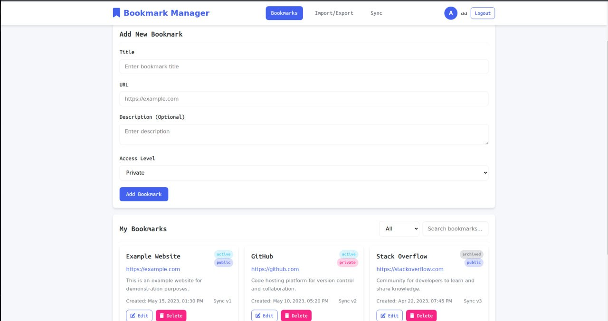
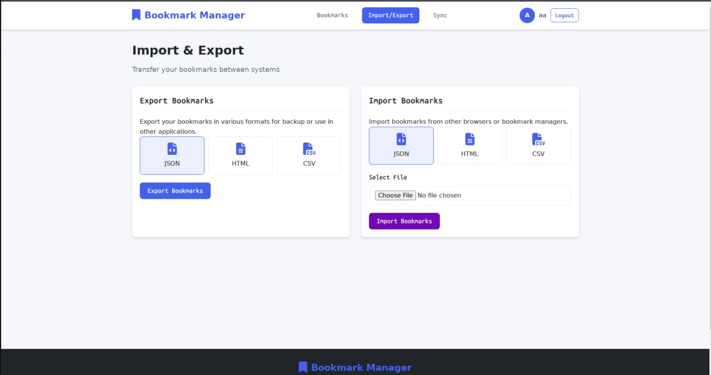

# Bookmark Manager

## 🎯 О проекте
Веб-приложение для управления закладками с синхронизацией между устройствами и расширенными функциями импорта/экспорта.

## ⚡ Основные функции
- **Управление закладками** - создание, редактирование, удаление
- **Синхронизация** - автоматическая между устройствами  
- **Экспорт/Импорт** - в форматах JSON, HTML, CSV
- **Доступ** - настройка приватных/публичных коллекций
- **Адаптивность** - работает на всех устройствах

## 🚀 Быстрый запуск

```bash
# Установка зависимостей
pip install -r requirements.txt

# Запуск приложения
docker-compose up --build
```

Приложение будет доступно по адресу: `http://localhost:8080`

## 🧪 Запуск тестов

```bash
python tests/run_tests.py
```

## 📚 Документация API
`openapi.yaml`

## 📸 Превью


